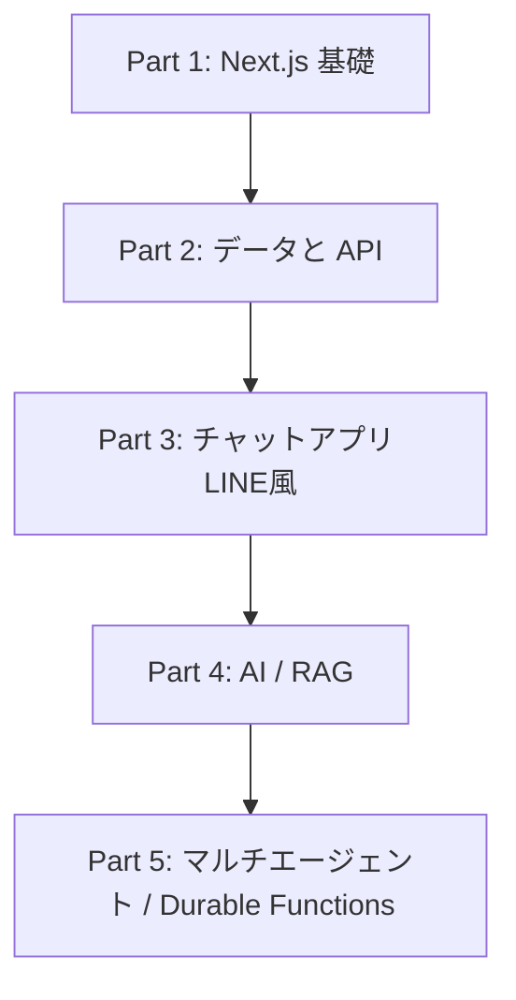

# Next.js 実践カリキュラム

環境構築から始め、**Hello World → LINE風チャットアプリ → RAG → マルチエージェント (Azure Durable Functions)** まで、
手を動かしながら段階的に学べる教材です。

各ステージは「課題（問題）」形式になっています。解説を読んだあと、自分で実装し、`完了条件` を満たせば次のステージに進みましょう。

---

## 全体ロードマップ

## ステージ一覧

### Part 1: Next.js の基礎
| Stage | テーマ | ゴール |
|-------|--------|--------|
| [01](./stage-01-setup-hello-world/README.md) | 環境構築と Hello World | 開発環境を整え、画面に文字を出す |
| [02](./stage-02-routing/README.md) | ページとルーティング | App Router で複数ページを作る |
| [03](./stage-03-components-props/README.md) | コンポーネントと Props | UI を部品化して再利用する |
| [04](./stage-04-styling/README.md) | スタイリング | Tailwind CSS / shadcn/ui で装飾する |
| [05](./stage-05-state-events/README.md) | State とイベント | useState / useEffect で動きをつける |

### Part 2: データと API
| Stage | テーマ | ゴール |
|-------|--------|--------|
| [06](./stage-06-route-handlers/README.md) | Route Handlers | API エンドポイントを作る |
| [07](./stage-07-data-fetching/README.md) | データ取得 | Server Components でデータを表示する |
| [08](./stage-08-forms-validation/README.md) | フォームとバリデーション | react-hook-form + zod で入力を扱う |
| [09](./stage-09-database/README.md) | データベース連携 | Prisma で永続化する |

### Part 3: チャットアプリ（LINE風）
| Stage | テーマ | ゴール |
|-------|--------|--------|
| [10](./stage-10-chat-ui/README.md) | チャット UI | 吹き出し UI を作る |
| [11](./stage-11-chat-messaging/README.md) | メッセージ送受信 | DB に保存し一覧表示する |
| [12](./stage-12-realtime/README.md) | リアルタイム通信 | SSE / WebSocket で即時反映する |
| [13](./stage-13-auth/README.md) | 認証 | ログインとユーザー管理を入れる |

### Part 4: AI / RAG
| Stage | テーマ | ゴール |
|-------|--------|--------|
| [14](./stage-14-llm-basics/README.md) | LLM 連携 | Azure OpenAI を呼び出す |
| [15](./stage-15-ai-chatbot/README.md) | AI チャットボット | ストリーミング応答を実装する |
| [16](./stage-16-embeddings/README.md) | 埋め込みとベクトル検索 | ドキュメントを検索可能にする |
| [17](./stage-17-rag/README.md) | RAG アプリ | 社内資料に答えるボットを作る |

### Part 5: マルチエージェント
| Stage | テーマ | ゴール |
|-------|--------|--------|
| [18](./stage-18-mcp/README.md) | MCP 連携 | Model Context Protocol でツールを繋ぐ |
| [19](./stage-19-durable-functions/README.md) | Durable Functions 入門 | オーケストレーションの基礎 |
| [20](./stage-20-multi-agent/README.md) | マルチエージェント | 複数エージェントを協調させる |

---

## 学習の進め方

1. 各ステージの `README.md` を上から読む。
2. 「課題」を自分の手で実装する。**コピペではなく書いて理解する**こと。
3. 「完了条件」をすべて満たせたら次へ。
4. 余裕があれば「発展課題」に挑戦する。

## 推奨環境
- Node.js 20 以上
- エディタ: VS Code
- Git / GitHub アカウント
- (Part 4 以降) Azure OpenAI のアクセス

## このリポジトリについて
本リポジトリ自体が完成形の Next.js プロジェクト（App Router + TypeScript + Tailwind + shadcn/ui + AI SDK + MCP）です。
教材を進めながら、実装の参考として `src/` 以下を読むこともできます。
