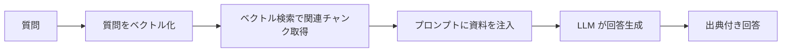

# Stage 17: RAG アプリ（社内資料に答えるボット）

埋め込み検索と LLM を組み合わせ、「自分の資料に基づいて答える」AI を作ります。これが RAG です。

## 学習目標
- RAG（Retrieval-Augmented Generation）の全体像を理解する
- 検索結果をプロンプトに注入（コンテキスト挿入）できる
- 出典付きで回答を生成できる
- ハルシネーション（嘘）を抑える工夫を知る

## 前提
- Stage 15・Stage 16 完了

## 背景解説

### RAG とは
LLM は学習時の知識しか持たず、社内資料や最新情報は知りません。
RAG は「質問に関連する文書を検索 → その内容をプロンプトに添えて LLM に渡す」ことで、
資料に基づいた回答をさせる手法です。



### コンテキスト注入の例
```ts
const context = relevantChunks.map((c) => c.text).join("\n---\n");

const result = streamText({
  model: azure(deployment),
  system: `あなたは社内アシスタントです。以下の【資料】だけを根拠に答えてください。
資料にない場合は「資料に記載がありません」と答えること。
【資料】
${context}`,
  messages,
});
```

## 課題

### 課題 17-1: ドキュメント取り込み
任意のテキスト資料（FAQ や Markdown）をチャンク化＆ベクトル化して保存する取り込み処理（インジェスト）を作る。

### 課題 17-2: RAG パイプライン
質問を受け取り、(1) ベクトル検索で上位 k 件のチャンク取得 → (2) プロンプトに注入 → (3) ストリーミング回答、の流れを実装する。

### 課題 17-3: 出典表示
回答の下に、参照したチャンク（出典）を一覧表示する。資料に無い質問には「資料に記載がありません」と答えさせる。

## 完了条件
- [ ] 資料を取り込み（インジェスト）できる
- [ ] 資料の内容に基づいた回答が返る
- [ ] 回答に出典が表示される
- [ ] 資料に無いことを聞くと「記載がありません」と答える

## 発展課題
- 取り込み元を PDF / Web ページに拡張する。
- 検索精度を上げる「リランキング」や「ハイブリッド検索（キーワード＋ベクトル）」を試す。
- Stage 13 の認証と組み合わせ、ユーザーごとに閲覧可能な資料を制限する。

## つまずきポイント
- **的外れな回答**: チャンクサイズ・取得件数 k・system プロンプトを調整。
- **資料を無視して答える**: 「資料だけを根拠に」と強く指示し、無い場合の振る舞いを明示。

## 参考リンク
- [RAG とは（Microsoft Learn）](https://learn.microsoft.com/azure/search/retrieval-augmented-generation-overview)
- [Azure AI Search](https://learn.microsoft.com/azure/search/)

➡️ 次は [Stage 18: MCP 連携](../stage-18-mcp/README.md)
