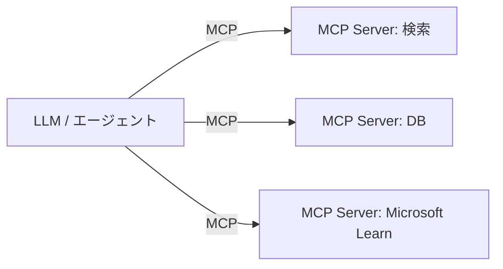

# Stage 18: MCP 連携（Model Context Protocol）

AI に「外部ツールを使う力」を与えます。MCP を通じて、AI が DB 検索や API 実行などの操作を行えるようにします。

## 学習目標
- MCP（Model Context Protocol）の目的と構成を理解する
- MCP サーバーが提供する「ツール」を AI から呼べる
- AI SDK のツール呼び出し（tool calling）を実装できる
- このリポジトリの Microsoft Learn MCP 連携の意味を理解する

## 前提
- Stage 17 完了（このリポジトリには `@modelcontextprotocol/sdk` 導入済み）

## 背景解説

### MCP とは
AI モデルと外部ツール／データソースを繋ぐ標準プロトコルです。
「AI が使える道具（ツール）」を統一的な形で公開でき、複数の AI クライアントから再利用できます。



### ツール呼び出し（AI SDK）
LLM に「使える関数」を渡すと、必要に応じて AI が引数を決めて呼び出します。

```ts
import { azure } from "@ai-sdk/azure";
import { generateText, tool } from "ai";
import { z } from "zod";

const { text } = await generateText({
  model: azure(deployment),
  prompt: "東京の天気を調べて",
  tools: {
    getWeather: tool({
      description: "指定都市の天気を取得",
      parameters: z.object({ city: z.string() }),
      execute: async ({ city }) => ({ city, weather: "晴れ" }),
    }),
  },
  maxSteps: 5, // ツール実行→再推論を繰り返す
});
```

### MCP クライアント
MCP サーバーが公開するツールを取り込み、上記 `tools` として AI に渡せます。
このリポジトリ（microsoft-learn-mcp-connect）は Microsoft Learn の MCP サーバーに接続し、ドキュメント検索ツールを AI に使わせる例です。

## 課題

### 課題 18-1: 自作ツール
`generateText` に 1〜2 個の自作ツール（例: 計算、現在時刻、DB 検索）を渡し、AI が状況に応じて呼ぶことを確認する。

### 課題 18-2: MCP サーバー接続
`@modelcontextprotocol/sdk` で MCP サーバーに接続し、提供されるツール一覧を取得して AI に渡す。

### 課題 18-3: RAG × ツール
Stage 17 の RAG ボットに「資料検索ツール」を持たせ、AI が必要なときだけ検索を呼ぶ「エージェント的 RAG」にする。

## 完了条件
- [ ] AI が自作ツールを適切なタイミングで呼ぶ
- [ ] MCP サーバーのツールを AI から利用できる
- [ ] ツール呼び出しの引数・結果をログで確認できる
- [ ] MCP の役割を自分の言葉で説明できる

## 発展課題
- 複数の MCP サーバーを同時に接続し、AI に使い分けさせる。
- ツール実行に権限チェック（認証ユーザーのみ）を入れる。

## つまずきポイント
- **ツールが呼ばれない**: `description` と `parameters` が曖昧だと AI が呼べない。具体的に書く。
- **無限ループ**: `maxSteps` を設定して再帰の上限を決める。

## 参考リンク
- [Model Context Protocol](https://modelcontextprotocol.io/)
- [AI SDK: Tool Calling](https://sdk.vercel.ai/docs/ai-sdk-core/tools-and-tool-calling)

➡️ 次は [Stage 19: Durable Functions 入門](../stage-19-durable-functions/README.md)
