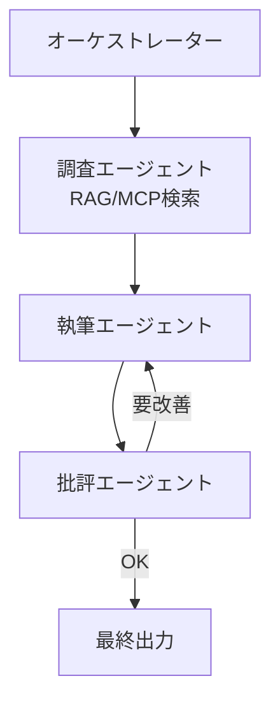

# Stage 20: マルチエージェント（Durable Functions で協調）

最終ステージです。役割の違う複数の AI エージェントを Durable Functions で協調させ、
1 つの複雑なタスクを解かせます。

## 学習目標
- マルチエージェントの代表的パターンを理解する
- 各エージェントを「アクティビティ関数」として実装できる
- オーケストレーターでエージェント間の流れを制御できる
- これまでの全要素（RAG / MCP / Durable）を統合できる

## 前提
- Stage 17・Stage 18・Stage 19 完了

## 背景解説

### マルチエージェントとは
1 つの大きな LLM に全部やらせるのではなく、**専門特化した複数エージェント**に分担・協調させる手法です。
役割を分けることで精度・保守性・拡張性が上がります。

### 代表的パターン
| パターン | 説明 |
|----------|------|
| オーケストレーター/ワーカー | 統括役が作業を分解し、専門エージェントに割り振る |
| パイプライン（順次） | 調査 → 執筆 → レビュー のように直列に渡す |
| ファンアウト（並列） | 複数観点を同時に処理して統合 |
| 議論/批評 | 生成役と批評役が往復して品質を高める |

### Durable Functions で表現する理由
エージェント連携は「長時間・多段・並列・リトライ・状態保持」が必要。これは Durable Functions が得意とする領域です。
各エージェント = アクティビティ関数、流れ = オーケストレーター、という対応で自然に書けます。



### オーケストレーション例
```ts
df.app.orchestration("agentTeam", function* (context) {
  const research = yield context.df.callActivity("researchAgent", context.df.getInput());
  let draft = yield context.df.callActivity("writerAgent", research);
  for (let i = 0; i < 3; i++) {
    const review = yield context.df.callActivity("criticAgent", draft);
    if (review.approved) break;
    draft = yield context.df.callActivity("writerAgent", { research, feedback: review.feedback });
  }
  return draft;
});
```

各アクティビティ（`researchAgent` など）の中で、Stage 14-18 の AI 呼び出し・RAG 検索・MCP ツールを使います。

## 課題

### 課題 20-1: エージェント定義
最低 3 つのエージェントをアクティビティ関数として作る。
例: 「調査（RAG/MCP で資料収集）」「執筆（回答生成）」「批評（品質チェック）」。各エージェントに専用の system プロンプトを与える。

### 課題 20-2: 協調オーケストレーション
オーケストレーターで「調査 → 執筆 → 批評 →（必要なら執筆に戻る）」のループを実装する。
批評エージェントが OK を出すか、最大回数で終了する。

### 課題 20-3: 統合とフロント接続
Next.js のチャット画面から Durable Functions のクライアント関数を起動し、ステータス照会で進捗を表示、完了したら最終回答を表示する。

## 完了条件
- [ ] 役割の異なる 3 つ以上のエージェントが動く
- [ ] オーケストレーターがエージェント間の流れを制御する
- [ ] 批評→修正のループが機能する
- [ ] Next.js フロントから起動・進捗確認・結果表示ができる
- [ ] RAG / MCP / Durable Functions が 1 つのアプリに統合されている

## 発展課題
- 並列調査（複数ソースを同時に検索）してから統合する。
- エージェントごとに異なるモデル（速い/賢い）を使い分ける。
- 各ステップのログ・コスト・所要時間を可視化するダッシュボードを作る。

## つまずきポイント
- **ループが収束しない**: 批評の合格基準を明確にし、最大反復回数を必ず設ける。
- **状態が膨らむ**: オーケストレーターに巨大データを持たせず、ID やストレージ参照を渡す。

## おめでとうございます 🎉
全 20 ステージ完走です。あなたは Next.js の基礎から、チャットアプリ・RAG・
マルチエージェント（Durable Functions）まで、実務レベルのフルスタック AI アプリ開発を一通り習得しました。

## 参考リンク
- [AI Agent Orchestration Patterns (Microsoft Learn)](https://learn.microsoft.com/azure/architecture/ai-ml/guide/ai-agent-design-patterns)
- [Durable Functions パターン](https://learn.microsoft.com/azure/azure-functions/durable/durable-functions-overview#application-patterns)

⬅️ [カリキュラムトップに戻る](../README.md)
